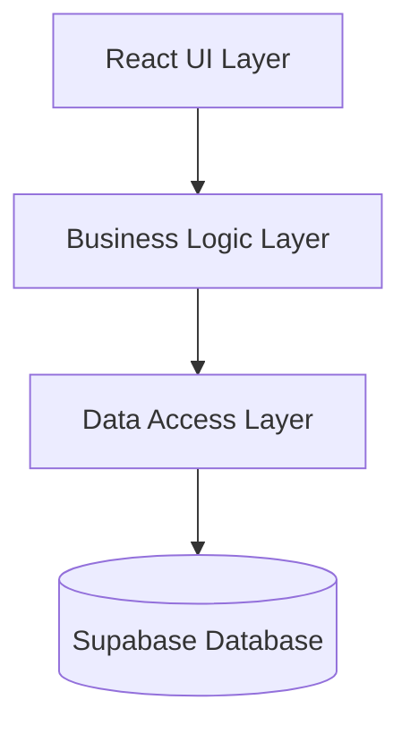

# SKIIN Switzerland - Heart Health Screening Platform

<p align="center">
  
</p>

<p align="center">
  <strong>Advanced cardiac monitoring for Swiss healthcare</strong><br>
  Multi-language platform with comprehensive eligibility screening and insurance integration
</p>

<p align="center">
  
  
  
  
  
</p>

---

## 🚀 Quick Start

```bash
# Clone repository
git clone https://github.com/nanoleq/skiin-switzerland.git
cd skiin-switzerland

# Install dependencies
npm install

# Set up environment variables
cp .env.example .env.local

# Start development server
npm run dev

# Build for production
npm run build
```

The application will be available at `http://localhost:8080`

## 📋 Project Overview

### Vision & Mission
SKIIN Switzerland provides accessible, professional cardiac health screening services integrated with the Swiss healthcare system. Our platform enables early detection and prevention of heart conditions through advanced monitoring technology.

### Key Features
- **🌍 Multi-language Support**: Full support for German, French, Italian, and English
- **📋 Eligibility Questionnaire**: 6-stage comprehensive health screening workflow
- **🏥 Insurance Integration**: Direct integration with 9 major Swiss insurance providers
- **🔐 Security First**: OTP verification, rate limiting, PCI DSS compliance
- **♿ Accessibility**: WCAG 2.1 AA compliant for inclusive healthcare access
- **⚡ Performance**: Sub-50ms load times with optimized Core Web Vitals
- **🎨 Design System**: Consistent S&W design system with Tailwind CSS

### Technology Stack

#### Frontend
- **Framework**: React 18 with TypeScript 5 (strict mode)
- **Build Tool**: Vite 5 for lightning-fast development
- **Styling**: Tailwind CSS + shadcn/ui components
- **State Management**: Context API + TanStack Query
- **Forms**: React Hook Form + Zod validation
- **Routing**: React Router v6 with i18n support

#### Backend & Database
- **Database**: Supabase (PostgreSQL) with Row Level Security
- **Authentication**: Supabase Auth with OTP verification
- **Edge Functions**: Deno-based serverless functions
- **Storage**: Supabase Storage for documents
- **Security**: bcrypt hashing, rate limiting, session management

#### Testing & Quality
- **Unit Testing**: Vitest with 80% coverage requirement
- **E2E Testing**: Playwright for critical user journeys
- **Accessibility**: axe-core automated testing
- **Performance**: Lighthouse CI monitoring

## 💻 Development

### Prerequisites
- Node.js 18+ (recommend using [nvm](https://github.com/nvm-sh/nvm))
- npm 9+ or yarn 1.22+
- Git 2.30+
- VS Code (recommended) with extensions:
  - ESLint
  - Prettier
  - Tailwind CSS IntelliSense
  - TypeScript Vue Plugin

### Installation

1. **Clone the repository**
```bash
git clone https://github.com/nanoleq/skiin-switzerland.git
cd skiin-switzerland
```

2. **Install dependencies**
```bash
npm install
```

3. **Environment Setup**
```bash
# Copy environment template
cp .env.example .env.local

# Configure the following variables:
# VITE_SUPABASE_URL=your_supabase_url
# VITE_SUPABASE_ANON_KEY=your_supabase_anon_key
# VITE_STRIPE_PUBLIC_KEY=your_stripe_key
# VITE_GA_MEASUREMENT_ID=your_ga_id
```

4. **Database Setup**
```bash
# Run Supabase migrations
npm run supabase:migrate

# Seed initial data (optional)
npm run supabase:seed
```

### Available Scripts

```bash
# Development
npm run dev              # Start dev server (port 8080)
npm run dev:host         # Expose to network
npm run dev:https        # Start with HTTPS

# Building
npm run build            # Production build
npm run preview          # Preview production build

# Testing
npm run test             # Run unit tests
npm run test:e2e         # Run E2E tests
npm run test:coverage    # Generate coverage report
npm run test:a11y        # Run accessibility tests

# Code Quality
npm run lint             # ESLint with auto-fix
npm run format           # Prettier formatting
npm run typecheck        # TypeScript checking
npm run check            # Run all checks
npm run check:all        # Full validation suite

# Database
npm run supabase:migrate # Run migrations
npm run supabase:types   # Generate TypeScript types
npm run supabase:reset   # Reset database

# Utilities
npm run analyze          # Bundle size analysis
npm run lighthouse       # Performance audit
```

### Project Structure

```
src/
├── components/          # React components (Atomic Design)
│   ├── ui/             # Base shadcn/ui components
│   ├── forms/          # Form components
│   │   └── eligibility/  # 14 atomic eligibility components
│   ├── layout/         # Layout components
│   └── features/       # Feature-specific components
├── pages/              # Route components
├── services/           # Business logic & API
├── hooks/              # Custom React hooks
├── contexts/           # React Context providers
├── utils/              # Utility functions
├── types/              # TypeScript definitions
└── translations/       # i18n language files

supabase/
├── migrations/         # SQL migrations (12 files)
├── functions/          # Edge functions
├── schemas/           # Database schemas
└── policies/          # RLS policies

docs/
├── architecture/       # System design docs
├── database/          # Database documentation
├── design-system/     # Design tokens & components
├── standards/         # Coding standards
└── testing/          # Test documentation
```

## 🏗 Architecture

### System Design
Our architecture follows Domain-Driven Design principles with clear separation of concerns:



### Component Architecture
We follow **Atomic Design** methodology with strict size constraints:

- **Atoms**: ≤50 lines - Basic UI elements (Button, Input)
- **Molecules**: ≤50 lines - Simple combinations (FormField)
- **Organisms**: ≤150 lines - Complex components (Header)
- **Templates**: Page layouts
- **Pages**: Route components with data fetching

### Database Schema
- **14 Core Tables**: Users, insurance, eligibility, sessions, payments
- **Row Level Security**: All tables protected with RLS policies
- **Audit Trail**: Complete activity logging for compliance
- **GDPR Compliant**: Data retention and deletion workflows

### API Architecture
- **RESTful Design**: Standard HTTP methods and status codes
- **Authentication**: JWT-based with refresh tokens
- **Rate Limiting**: 5 requests/10 minutes for sensitive operations
- **Error Handling**: Consistent error response format

## 🧪 Testing

### Test Strategy
We maintain comprehensive test coverage across multiple levels:

#### Unit Tests (Vitest)
- **Coverage Requirements**: 80% for services, 70% for utilities
- **Test Location**: Co-located with components (`*.test.ts`)
- **Mocking**: Minimal mocking, prefer integration tests

```bash
npm run test              # Run all tests
npm run test:watch        # Watch mode
npm run test:coverage     # Coverage report
```

#### E2E Tests (Playwright)
- **Critical Paths**: Eligibility flow, payment, insurance selection
- **Browsers**: Chrome, Firefox, Safari, Mobile
- **Visual Regression**: Screenshot comparison

```bash
npm run test:e2e          # Run E2E tests
npm run test:e2e:debug    # Debug mode
npm run test:e2e:ui       # UI mode
```

#### Accessibility Tests
- **Automated**: axe-core integration in unit tests
- **Manual**: Screen reader testing checklist
- **Compliance**: WCAG 2.1 AA validation

```bash
npm run test:a11y         # Run accessibility audit
```

### Performance Benchmarks
- **LCP**: < 2.5s (target: 1.8s)
- **FID**: < 100ms (target: 50ms)
- **CLS**: < 0.1 (target: 0.05)
- **TTI**: < 3.8s (target: 3.0s)

## 📚 Documentation

### API Reference
Complete API documentation available at `/docs/api/`

- [Authentication](docs/api/authentication.md)
- [Eligibility](docs/api/eligibility.md)
- [Insurance](docs/api/insurance.md)
- [Payments](docs/api/payments.md)

### Component Library
Interactive component documentation at `/docs/design-system/`

- [Design Tokens](docs/design-system/tokens.md)
- [Components](docs/design-system/components/)
- [Patterns](docs/design-system/patterns.md)

### Database Schema
- [Schema Overview](docs/database/schema-v2.md)
- [Migration Guide](docs/database/migration-guide.md)
- [Security Model](docs/database/security-enhancement.json)

## 🔐 Security

### Authentication & Authorization
- **Multi-factor**: Email/SMS OTP verification
- **Session Management**: Secure httpOnly cookies
- **Token Rotation**: Automatic refresh token rotation
- **Rate Limiting**: Progressive delays on failed attempts

### Data Protection
- **Encryption**: TLS 1.3 for all connections
- **Hashing**: bcrypt with salt rounds
- **PCI DSS**: Level 1 compliance for payments
- **GDPR**: Full compliance with data subject rights

### Swiss Compliance
- **BehiG**: Disability discrimination act compliance
- **Swiss DPA**: Data Protection Act adherence
- **Healthcare Standards**: Medical data handling regulations
- **Canton Requirements**: All 26 cantons supported

## 🌍 Internationalization

### Supported Languages
- 🇬🇧 **English** (en)
- 🇩🇪 **German** (de) - Primary
- 🇫🇷 **French** (fr)
- 🇮🇹 **Italian** (it)

### Routing Structure
```
/                    # English
/de/                 # German
/fr/                 # French
/it/                 # Italian

/de/loesungen/14-tage-holter
/fr/solutions/holter-14-jours
/it/soluzioni/holter-14-giorni
```

### Translation Management
- **File Structure**: `/src/translations/{lang}/`
- **Fallback**: English as default
- **Dynamic Loading**: Lazy-loaded per route
- **Pluralization**: Full ICU MessageFormat support

## 🚢 Deployment

### Build Process
```bash
# Production build
npm run build

# Analyze bundle
npm run analyze

# Type checking
npm run typecheck

# Full validation
npm run check:all
```

### Environment Configuration
```env
# Production
VITE_ENV=production
VITE_SUPABASE_URL=https://xxx.supabase.co
VITE_SUPABASE_ANON_KEY=xxx
VITE_API_URL=https://api.skiin.ch
```

### Production Checklist
- [ ] Environment variables configured
- [ ] Database migrations applied
- [ ] SSL certificates valid
- [ ] CDN configured
- [ ] Monitoring enabled
- [ ] Backup strategy implemented
- [ ] Rate limiting configured
- [ ] Security headers set

### Monitoring
- **Application**: Sentry for error tracking
- **Performance**: Google Analytics + Core Web Vitals
- **Availability**: Uptime monitoring
- **Security**: Web Application Firewall (WAF)

## 🤝 Contributing

We welcome contributions! Please see our [Contributing Guide](CONTRIBUTING.md) for details.

### Development Workflow
1. Fork the repository
2. Create feature branch (`feature/amazing-feature`)
3. Commit changes (`feat: add amazing feature`)
4. Push to branch (`git push origin feature/amazing-feature`)
5. Open Pull Request

### Code Standards
- **TypeScript**: Strict mode, no `any`
- **Components**: Atomic design, ≤50 lines for atoms
- **Testing**: Minimum 70% coverage
- **Accessibility**: WCAG 2.1 AA required
- **Performance**: Core Web Vitals targets

### Commit Convention
We follow [Conventional Commits](https://www.conventionalcommits.org/):

```
feat: add new component
fix: resolve navigation issue
docs: update README
style: format code
refactor: reorganize utils
test: add unit tests
chore: update dependencies
```

## 📄 License

This project is proprietary software. All rights reserved.

© 2025 Myant Health Switzerland AG

## 🆘 Troubleshooting

### Common Issues

#### Port Already in Use
```bash
# Kill process on port 8080
lsof -ti:8080 | xargs kill -9
```

#### Database Connection Failed
```bash
# Reset Supabase connection
npm run supabase:reset
```

#### Type Errors After Update
```bash
# Regenerate types
npm run supabase:types
```

### FAQ

**Q: How do I add a new language?**
A: Add translation files to `/src/translations/{lang}/` and update `routeTranslations.ts`

**Q: How do I run specific tests?**
A: Use `npm run test -- --grep "pattern"` for pattern matching

**Q: How do I debug E2E tests?**
A: Run `npm run test:e2e:debug` to open Playwright inspector

### Support Channels
- **Documentation**: [docs.skiin.ch](https://docs.skiin.ch)
- **Issues**: [GitHub Issues](https://github.com/nanoleq/skiin-switzerland/issues)
- **Email**: support@skiin.ch
- **Slack**: [Join our workspace](https://skiin.slack.com)

## 📈 Changelog

See [CHANGELOG.md](CHANGELOG.md) for detailed version history.

### Latest Release: v2.1.0 (2025-08-25)
- ✨ 6-stage eligibility workflow
- 🔐 Enhanced OTP security
- ♿ WCAG 2.1 AA compliance
- 🚀 Performance optimizations
- 🌍 Complete Italian translations

---

<p align="center">
  Built with ❤️ in Switzerland 🇨🇭
</p>