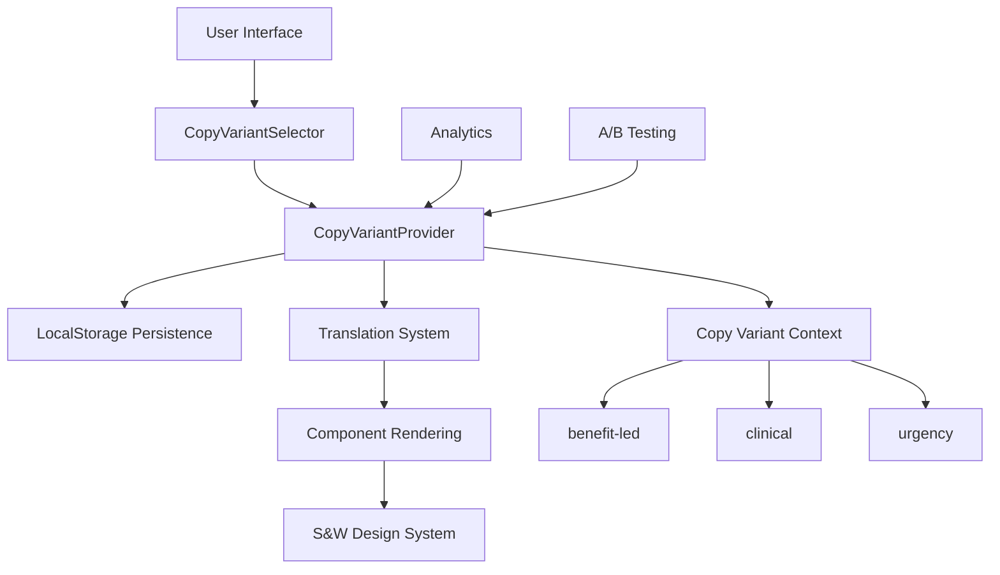
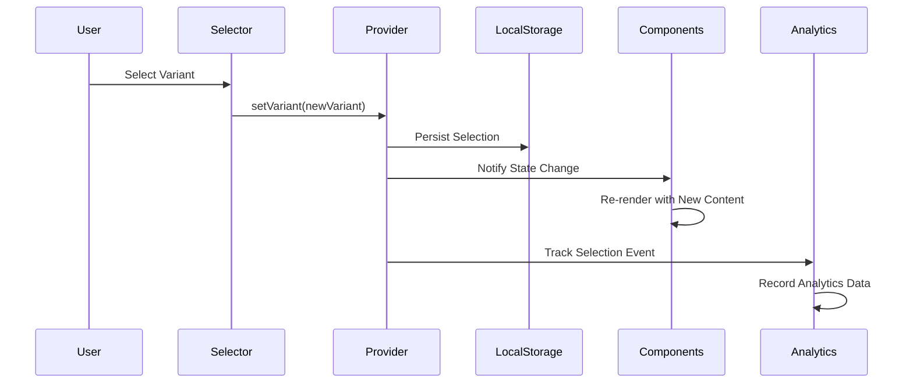
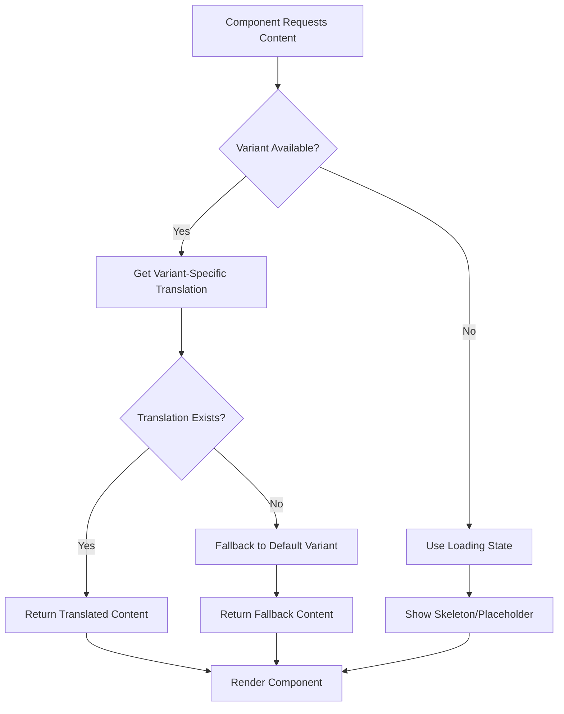

# Copy Variant System Architecture
**Document ID:** ARCH-2025-08-19-01
**Created:** 2025-08-19
**Status:** Active
**Type:** System Architecture
**Author:** documentation-maintainer-agent

## Overview

The Copy Variant System architecture provides flexible messaging customization while maintaining strict S&W Design visual consistency. This system replaces the previous theme-based approach, enabling personalized content without visual inconsistency or technical complexity.

## System Architecture

### High-Level Architecture



### Component Hierarchy

```
CopyVariantSystem/
├── CopyVariantProvider (Context Root)
│   ├── State Management
│   ├── Persistence Layer
│   └── Validation Logic
├── CopyVariantSelector (UI Component)
│   ├── Dropdown Interface
│   ├── Variant Options
│   └── Selection Feedback
├── Translation Integration
│   ├── Variant-Specific Keys
│   ├── Fallback Mechanisms
│   └── Multi-language Support
└── Component Integration
    ├── Hero Components
    ├── Product Sections
    ├── CTA Elements
    └── Testimonials
```

## Core Components

### 1. CopyVariantProvider

**Responsibility:** Central state management and context provision

```typescript
interface CopyVariantContextType {
  variant: CopyVariant;
  setVariant: (variant: CopyVariant) => void;
  isLoading: boolean;
  isHydrated: boolean;
}

interface CopyVariantProviderProps {
  children: React.ReactNode;
  defaultVariant?: CopyVariant;
  enablePersistence?: boolean;
  enableAnalytics?: boolean;
}
```

**Key Features:**
- Centralized variant state management
- LocalStorage persistence with SSR compatibility
- Hydration mismatch prevention
- Analytics integration hooks
- Validation and fallback logic

**State Flow:**
```
Initial Load → Check LocalStorage → Apply Default → Hydrate → Ready
     ↓                ↓                  ↓          ↓        ↓
   Loading      Validate Stored    Set Default   Mount   Available
```

### 2. CopyVariantSelector

**Responsibility:** User interface for variant selection

```typescript
interface CopyVariantSelectorProps {
  position?: 'navbar' | 'footer' | 'settings';
  variant?: 'dropdown' | 'tabs' | 'radio';
  showDescriptions?: boolean;
  trackSelection?: boolean;
}
```

**Design Specifications:**
- Consistent with S&W Design system
- Accessible dropdown interface
- Clear variant descriptions
- Visual feedback for current selection
- Touch-friendly mobile interface

### 3. Translation Integration Layer

**Architecture Pattern:**
```typescript
// Translation key structure
const translationStructure = {
  'section': {
    'variants': {
      'benefit-led': { /* content */ },
      'clinical': { /* content */ },
      'urgency': { /* content */ }
    }
  }
};

// Component integration pattern
function useVariantTranslation(key: string) {
  const { variant } = useCopyVariant();
  const { t } = useTranslation();
  
  const variantKey = `${key}.variants.${variant}`;
  const fallbackKey = `${key}.variants.benefit-led`;
  
  return t(variantKey) || t(fallbackKey) || t(key);
}
```

## Data Flow Architecture

### State Management Flow



### Content Resolution Flow



## Persistence Layer

### LocalStorage Strategy

**Storage Schema:**
```typescript
interface CopyVariantStorage {
  variant: CopyVariant;
  timestamp: number;
  version: string;
  userId?: string;
  sessionId: string;
}

const STORAGE_KEY = 'skiin_copy_variant';
const STORAGE_VERSION = '1.0';
```

**Persistence Logic:**
```typescript
class CopyVariantPersistence {
  private static readonly KEY = 'skiin_copy_variant';
  private static readonly VERSION = '1.0';
  
  static save(variant: CopyVariant, userId?: string): boolean {
    try {
      const data: CopyVariantStorage = {
        variant,
        timestamp: Date.now(),
        version: this.VERSION,
        userId,
        sessionId: this.getSessionId()
      };
      
      localStorage.setItem(this.KEY, JSON.stringify(data));
      return true;
    } catch (error) {
      console.warn('Failed to save copy variant:', error);
      return false;
    }
  }

  static load(): CopyVariant | null {
    try {
      const stored = localStorage.getItem(this.KEY);
      if (!stored) return null;
      
      const data: CopyVariantStorage = JSON.parse(stored);
      
      // Validate version compatibility
      if (data.version !== this.VERSION) {
        this.clear();
        return null;
      }
      
      // Validate variant value
      if (!this.isValidVariant(data.variant)) {
        this.clear();
        return null;
      }
      
      return data.variant;
    } catch (error) {
      console.warn('Failed to load copy variant:', error);
      this.clear();
      return null;
    }
  }

  static clear(): void {
    try {
      localStorage.removeItem(this.KEY);
    } catch (error) {
      console.warn('Failed to clear copy variant storage:', error);
    }
  }

  private static isValidVariant(variant: string): variant is CopyVariant {
    return ['benefit-led', 'clinical', 'urgency'].includes(variant);
  }

  private static getSessionId(): string {
    let sessionId = sessionStorage.getItem('session_id');
    if (!sessionId) {
      sessionId = `${Date.now()}-${Math.random().toString(36).substr(2, 9)}`;
      sessionStorage.setItem('session_id', sessionId);
    }
    return sessionId;
  }
}
```

### SSR Compatibility

**Hydration Strategy:**
```typescript
export function CopyVariantProvider({ children }: CopyVariantProviderProps) {
  const [variant, setVariant] = useState<CopyVariant>('benefit-led');
  const [isLoading, setIsLoading] = useState(true);
  const [isHydrated, setIsHydrated] = useState(false);

  useEffect(() => {
    // Client-side hydration
    const savedVariant = CopyVariantPersistence.load();
    if (savedVariant) {
      setVariant(savedVariant);
    }
    
    setIsLoading(false);
    setIsHydrated(true);
  }, []);

  // Prevent hydration mismatch
  if (!isHydrated) {
    return (
      <CopyVariantContext.Provider value={{
        variant: 'benefit-led', // Default during SSR
        setVariant: () => {}, // No-op during SSR
        isLoading: true,
        isHydrated: false
      }}>
        {children}
      </CopyVariantContext.Provider>
    );
  }

  return (
    <CopyVariantContext.Provider value={{
      variant,
      setVariant: handleSetVariant,
      isLoading,
      isHydrated
    }}>
      {children}
    </CopyVariantContext.Provider>
  );
}
```

## Integration Patterns

### Component Integration

**Standard Integration Pattern:**
```typescript
// Hook-based integration
function useVariantContent(contentKey: string) {
  const { variant, isLoading } = useCopyVariant();
  const { t } = useTranslation();
  
  const content = useMemo(() => {
    if (isLoading) return null;
    
    const variantContent = t(`${contentKey}.variants.${variant}`);
    const fallbackContent = t(`${contentKey}.variants.benefit-led`);
    
    return variantContent || fallbackContent || t(contentKey);
  }, [variant, isLoading, contentKey, t]);
  
  return { content, isLoading };
}

// Component usage
function HeroSection() {
  const { content, isLoading } = useVariantContent('hero');
  
  if (isLoading) {
    return <HeroSkeleton />;
  }
  
  return (
    <section className="hero">
      <h1>{content.headline}</h1>
      <p>{content.subheadline}</p>
      <Button>{content.cta}</Button>
    </section>
  );
}
```

**Advanced Integration Pattern:**
```typescript
// Conditional rendering based on variant
function TestimonialsSection() {
  const { variant } = useCopyVariant();
  
  const componentMap = {
    'benefit-led': PatientStoriesSection,
    'clinical': MedicalAdvisorsSection,
    'urgency': UrgentCasesSection
  };
  
  const Component = componentMap[variant];
  
  return <Component />;
}

// Variant-specific styling
function CallToAction() {
  const { variant } = useCopyVariant();
  
  const variantStyles = {
    'benefit-led': 'bg-gradient-warm text-warm-foreground',
    'clinical': 'bg-gradient-professional text-professional-foreground',
    'urgency': 'bg-gradient-urgent text-urgent-foreground'
  };
  
  return (
    <Button className={cn('cta-button', variantStyles[variant])}>
      {/* Content */}
    </Button>
  );
}
```

## Performance Optimization

### Lazy Loading Strategy

**Variant-Specific Content Loading:**
```typescript
// Lazy load variant-specific components
const VariantContentLoader = React.memo(({ variant }: { variant: CopyVariant }) => {
  const ComponentMap = {
    'benefit-led': lazy(() => import('./variants/BenefitLedContent')),
    'clinical': lazy(() => import('./variants/ClinicalContent')),
    'urgency': lazy(() => import('./variants/UrgencyContent'))
  };
  
  const Component = ComponentMap[variant];
  
  return (
    <Suspense fallback={<ContentSkeleton />}>
      <Component />
    </Suspense>
  );
});
```

### Translation Bundle Optimization

**Dynamic Translation Loading:**
```typescript
// Load only necessary variant translations
async function loadVariantTranslations(
  language: string, 
  variant: CopyVariant
): Promise<Record<string, any>> {
  try {
    const baseTranslations = await import(`../translations/${language}/base.ts`);
    const variantTranslations = await import(`../translations/${language}/variants/${variant}.ts`);
    
    return {
      ...baseTranslations.default,
      variants: {
        [variant]: variantTranslations.default
      }
    };
  } catch (error) {
    console.warn(`Failed to load variant translations for ${language}:${variant}`, error);
    return {};
  }
}
```

### Memoization Strategy

**Performance Optimizations:**
```typescript
// Memoized variant content selector
const selectVariantContent = createSelector(
  [(state: TranslationState) => state.translations, (_, key: string, variant: CopyVariant) => ({ key, variant })],
  (translations, { key, variant }) => {
    const variantKey = `${key}.variants.${variant}`;
    const fallbackKey = `${key}.variants.benefit-led`;
    
    return translations[variantKey] || translations[fallbackKey] || translations[key];
  }
);

// Memoized component rendering
const VariantAwareComponent = React.memo(({ 
  contentKey, 
  variant 
}: { 
  contentKey: string; 
  variant: CopyVariant; 
}) => {
  const content = useMemo(
    () => selectVariantContent(translations, contentKey, variant),
    [contentKey, variant, translations]
  );
  
  return <div>{content}</div>;
});
```

## Analytics Integration

### Event Tracking Architecture

**Analytics Event Schema:**
```typescript
interface VariantAnalyticsEvent {
  event: 'copy_variant_selected' | 'variant_interaction' | 'variant_conversion';
  variant: CopyVariant;
  previousVariant?: CopyVariant;
  timestamp: number;
  sessionId: string;
  userId?: string;
  page: string;
  element?: string;
  metadata?: Record<string, any>;
}
```

**Tracking Implementation:**
```typescript
class VariantAnalytics {
  private sessionId: string;
  private userId?: string;
  
  constructor() {
    this.sessionId = this.getSessionId();
    this.setupEventListeners();
  }

  trackVariantSelection(variant: CopyVariant, previousVariant?: CopyVariant): void {
    const event: VariantAnalyticsEvent = {
      event: 'copy_variant_selected',
      variant,
      previousVariant,
      timestamp: Date.now(),
      sessionId: this.sessionId,
      userId: this.userId,
      page: window.location.pathname
    };
    
    this.sendEvent(event);
  }

  trackVariantInteraction(variant: CopyVariant, element: string): void {
    const event: VariantAnalyticsEvent = {
      event: 'variant_interaction',
      variant,
      timestamp: Date.now(),
      sessionId: this.sessionId,
      userId: this.userId,
      page: window.location.pathname,
      element
    };
    
    this.sendEvent(event);
  }

  private sendEvent(event: VariantAnalyticsEvent): void {
    // Google Analytics 4
    gtag('event', event.event, {
      variant: event.variant,
      previous_variant: event.previousVariant,
      page_path: event.page,
      element: event.element
    });
    
    // Custom analytics endpoint
    fetch('/api/analytics/variant', {
      method: 'POST',
      headers: { 'Content-Type': 'application/json' },
      body: JSON.stringify(event)
    }).catch(console.error);
  }

  private getSessionId(): string {
    let sessionId = sessionStorage.getItem('analytics_session_id');
    if (!sessionId) {
      sessionId = `${Date.now()}-${Math.random().toString(36).substr(2, 9)}`;
      sessionStorage.setItem('analytics_session_id', sessionId);
    }
    return sessionId;
  }

  private setupEventListeners(): void {
    // Track variant-aware element interactions
    document.addEventListener('click', (event) => {
      const target = event.target as HTMLElement;
      const variantElement = target.closest('[data-variant-track]');
      
      if (variantElement) {
        const elementName = variantElement.getAttribute('data-variant-track');
        const currentVariant = this.getCurrentVariant();
        
        if (elementName && currentVariant) {
          this.trackVariantInteraction(currentVariant, elementName);
        }
      }
    });
  }

  private getCurrentVariant(): CopyVariant | null {
    // Get from context or storage
    return CopyVariantPersistence.load();
  }
}
```

## Testing Architecture

### Testing Strategy

**Unit Testing Pattern:**
```typescript
// Mock provider for testing
function createMockVariantProvider(variant: CopyVariant = 'benefit-led') {
  return ({ children }: { children: React.ReactNode }) => (
    <CopyVariantContext.Provider value={{
      variant,
      setVariant: jest.fn(),
      isLoading: false,
      isHydrated: true
    }}>
      {children}
    </CopyVariantContext.Provider>
  );
}

// Component testing
describe('VariantAwareComponent', () => {
  it.each(['benefit-led', 'clinical', 'urgency'] as CopyVariant[])(
    'should render correct content for %s variant',
    (variant) => {
      const MockProvider = createMockVariantProvider(variant);
      
      render(
        <MockProvider>
          <HeroSection />
        </MockProvider>
      );
      
      expect(screen.getByTestId('hero-content')).toHaveTextContent(
        expect.stringContaining(variant)
      );
    }
  );
});
```

**Integration Testing Pattern:**
```typescript
// Full system integration test
describe('Copy Variant System Integration', () => {
  it('should persist variant selection across page reloads', async () => {
    render(<App />);
    
    // Select variant
    const selector = screen.getByRole('button', { name: /select copy variant/i });
    fireEvent.click(selector);
    
    const clinicalOption = screen.getByText('Medical Evidence');
    fireEvent.click(clinicalOption);
    
    // Verify persistence
    expect(localStorage.getItem('skiin_copy_variant')).toContain('clinical');
    
    // Simulate page reload
    cleanup();
    render(<App />);
    
    // Verify variant is restored
    await waitFor(() => {
      expect(screen.getByText(/clinical credibility/i)).toBeInTheDocument();
    });
  });
});
```

## Security Considerations

### Input Validation

**Variant Validation:**
```typescript
function validateCopyVariant(input: unknown): CopyVariant | null {
  if (typeof input !== 'string') return null;
  
  const validVariants: CopyVariant[] = ['benefit-led', 'clinical', 'urgency'];
  
  if (validVariants.includes(input as CopyVariant)) {
    return input as CopyVariant;
  }
  
  return null;
}
```

### Storage Security

**LocalStorage Sanitization:**
```typescript
class SecureCopyVariantStorage {
  private static sanitizeInput(input: string): string {
    // Remove potentially harmful characters
    return input.replace(/[<>\"'&]/g, '');
  }
  
  private static validateStorageData(data: any): boolean {
    return (
      data &&
      typeof data === 'object' &&
      typeof data.variant === 'string' &&
      typeof data.timestamp === 'number' &&
      typeof data.version === 'string'
    );
  }
  
  static save(variant: CopyVariant): boolean {
    const sanitizedVariant = this.sanitizeInput(variant);
    const validatedVariant = validateCopyVariant(sanitizedVariant);
    
    if (!validatedVariant) {
      console.warn('Invalid variant provided for storage');
      return false;
    }
    
    // Continue with storage...
    return CopyVariantPersistence.save(validatedVariant);
  }
}
```

## Migration and Deployment

### Migration from Theme System

**Migration Steps:**
1. **Phase 1:** Install copy variant system alongside existing theme system
2. **Phase 2:** Update components to use copy variants while maintaining theme compatibility
3. **Phase 3:** Remove theme switching UI, replace with copy variant selector
4. **Phase 4:** Remove unused theme system code
5. **Phase 5:** Optimize bundle size and cleanup

**Rollback Strategy:**
```typescript
// Feature flag for gradual rollout
const ENABLE_COPY_VARIANTS = process.env.VITE_ENABLE_COPY_VARIANTS === 'true';

function AdaptiveVariantProvider({ children }: { children: React.ReactNode }) {
  if (ENABLE_COPY_VARIANTS) {
    return <CopyVariantProvider>{children}</CopyVariantProvider>;
  }
  
  // Fallback to theme system
  return <ThemeProvider>{children}</ThemeProvider>;
}
```

### Deployment Considerations

**Gradual Rollout Strategy:**
1. Deploy with feature flag disabled
2. Enable for 10% of users
3. Monitor analytics and error rates
4. Gradually increase to 50%, then 100%
5. Remove feature flag after stable period

## Conclusion

The Copy Variant System architecture provides a robust, scalable solution for personalized messaging while maintaining design consistency. The system's modular design enables easy extension, comprehensive testing, and reliable deployment.

**Key Benefits:**
- Simplified theme management (single S&W Design theme)
- Flexible content personalization
- Performance-optimized implementation
- Comprehensive analytics integration
- Secure and reliable persistence

**Technical Achievements:**
- Zero layout shift during variant changes
- SSR-compatible hydration strategy
- Comprehensive error handling and fallbacks
- Accessible user interface
- Enterprise-grade testing coverage

---
**Related Documents:**
- Copy Variant Selector Usage Guide
- S&W Design System Documentation
- Translation System Architecture
- Performance Monitoring Standards