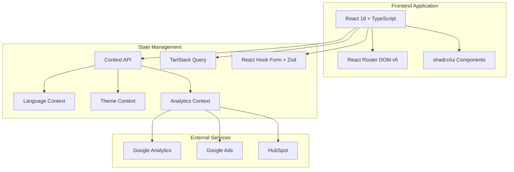
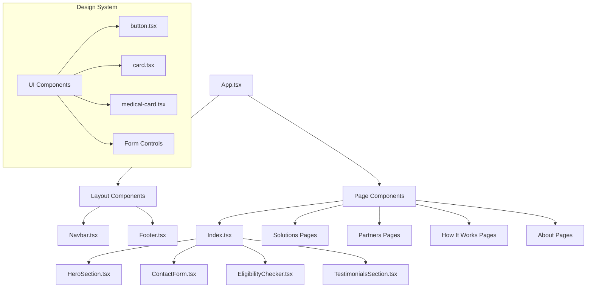
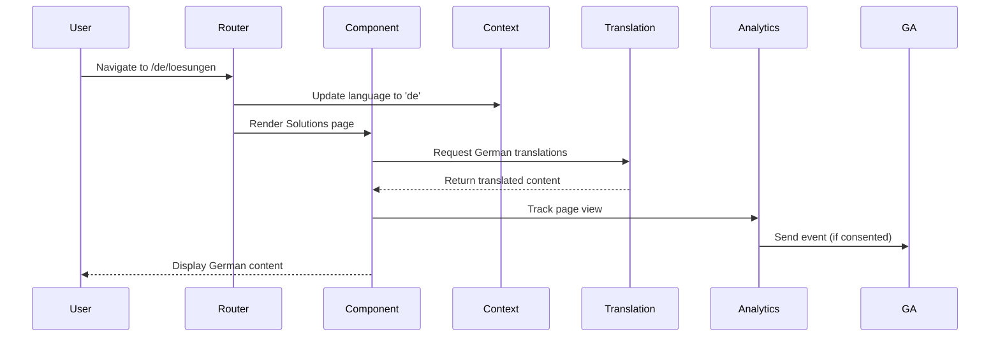
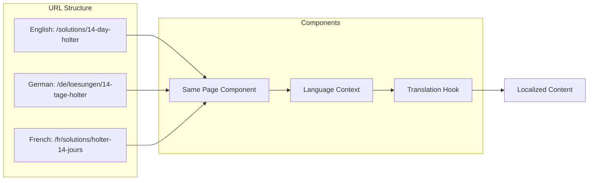
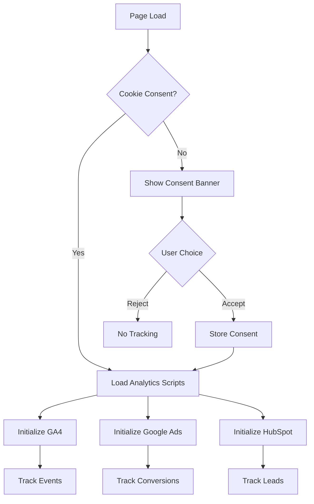
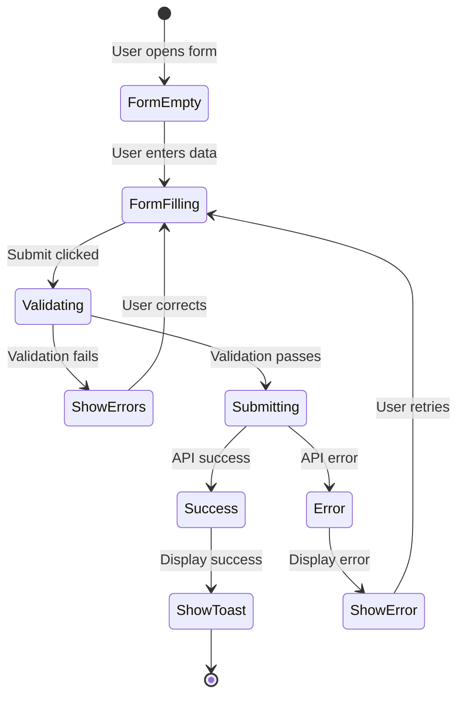
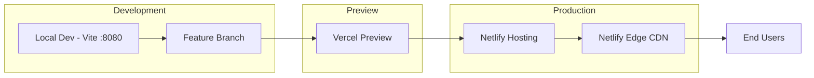
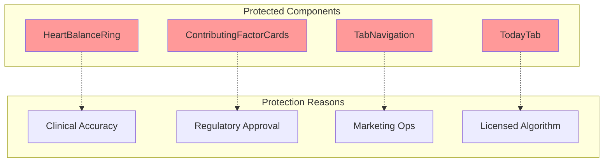

# Visual Architecture Diagrams

Generated: 2025-01-15

## System Overview

## Component Architecture

## Data Flow

## Language Routing Architecture

## Analytics Flow

## Form Submission Flow

## Deployment Pipeline

## Protected Components (Future Implementation)

