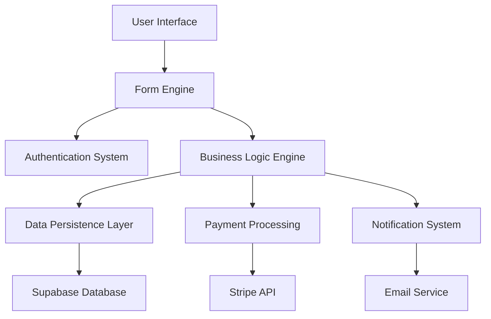

# Technical Specifications: Europe Eligibility Form System

## Overview

This document defines the technical requirements and specifications for the Swiss Holter monitoring eligibility questionnaire system, implementing an insurance-first flow that prioritizes early eligibility determination and user experience optimization.

## Table of Contents

- [Overview](#overview)
- [System Architecture](#system-architecture)
- [Functional Requirements](#functional-requirements)
- [Non-Functional Requirements](#non-functional-requirements)
- [Technical Constraints](#technical-constraints)
- [Acceptance Criteria](#acceptance-criteria)
- [Integration Requirements](#integration-requirements)
- [Security Requirements](#security-requirements)
- [Data Models](#data-models)
- [API Specifications](#api-specifications)
- [Testing Requirements](#testing-requirements)

## System Architecture

### Technology Stack
- **Frontend**: Next.js 14 with App Router, TypeScript, React 18+
- **UI Framework**: shadcn/ui components with originui enhancements
- **Styling**: Tailwind CSS 3+ with custom design tokens
- **Backend**: Supabase (PostgreSQL, Auth, Storage, Edge Functions)
- **State Management**: React Context with Zustand for complex state
- **Validation**: Zod schemas for runtime validation
- **Payments**: Stripe integration for self-pay users
- **Email**: Resend or SendGrid for transactional emails
- **File Storage**: Supabase Storage for document uploads

### High-Level Architecture



## Functional Requirements

### FR-1: Authentication System

**Description**: Secure user authentication using email OTP with session management and resume functionality.

**Acceptance Criteria**:
- **Given** a user provides a valid email address
- **When** they request account creation or login
- **Then** they receive an OTP code within 30 seconds
- **And** the OTP expires after 10 minutes
- **And** successful verification creates/resumes a session

**Implementation Details**:
- Use Supabase Auth magic links and OTP
- Store session data in secure HTTP-only cookies
- Support both email and phone OTP (phone only for self-pay users)
- Session persistence for up to 24 hours of inactivity

**Validation Rules**:
- Email format validation using RFC 5322 standard
- Rate limiting: max 3 OTP requests per email per 15 minutes
- Age verification: date of birth must indicate ≥ 18 years
- OTP format: 6-digit numeric code

### FR-2: Multi-Step Form Engine

**Description**: Interactive wizard supporting conditional rendering, progress tracking, and state persistence.

**Acceptance Criteria**:
- **Given** a user completes a form step
- **When** they navigate to the next step
- **Then** their previous answers are saved
- **And** conditional logic shows/hides relevant questions
- **And** progress indicator reflects current position

**Implementation Details**:
```typescript
interface FormStep {
  id: string;
  title: string;
  component: React.ComponentType;
  validationSchema: z.ZodSchema;
  conditional?: (data: FormData) => boolean;
  onComplete?: (data: StepData) => Promise<void>;
}
```

**Form Steps**:
1. **Step 0**: Contact & Account (email, DOB)
2. **Step 1**: Eligibility Gate (insurance, contraindications, symptoms)
3. **Stage 2**: Detailed Information (medical history, symptoms)
4. **Stage 3A**: Insured Path (GP details, consents)
5. **Stage 3B**: Self-Pay Path (phone, address, payment)
6. **Completion**: Next steps presentation

**Validation Rules**:
- Client-side validation using Zod schemas
- Server-side validation on form submission
- Real-time field validation on blur/change
- Progress blocked until current step validates

### FR-3: Insurance Eligibility Logic

**Description**: Core business logic determining user eligibility based on insurance status and symptoms.

**Acceptance Criteria**:
- **Given** a user has Swiss health insurance and ≥1 symptom
- **When** they complete the eligibility assessment
- **Then** they see "You may be eligible for reimbursement" message
- **And** they proceed to detailed information collection

**Business Rules**:
```typescript
enum EligibilityOutcome {
  ELIGIBLE_INSURED = 'eligible_insured',
  ELIGIBLE_SELF_PAY = 'eligible_self_pay', 
  INELIGIBLE_CONTRAINDICATION = 'ineligible_contraindication',
  SCREENING_NOT_COVERED = 'screening_not_covered'
}

function determineEligibility(
  hasInsurance: boolean,
  insuranceModel: InsuranceModel,
  hasSymptoms: boolean,
  hasContraindications: boolean
): EligibilityOutcome {
  if (hasContraindications) return INELIGIBLE_CONTRAINDICATION;
  if (hasInsurance && hasSymptoms) return ELIGIBLE_INSURED;
  if (hasInsurance && !hasSymptoms) return SCREENING_NOT_COVERED;
  return ELIGIBLE_SELF_PAY;
}
```

**Contraindication Checks**:
- Current pregnancy
- Pacemaker or ICD implant
- Cardiac hospitalization within 30 days
- Any "Yes" answer stops progression with safety message

### FR-4: Data Persistence & State Management

**Description**: Reliable form state persistence enabling resume functionality and data integrity.

**Acceptance Criteria**:
- **Given** a user partially completes the form
- **When** they return using their email login
- **Then** they resume at their last completed step
- **And** all previous answers are preserved

**Implementation Details**:
```typescript
interface FormSession {
  id: string;
  user_id: string;
  current_step: number;
  form_data: Record<string, unknown>;
  eligibility_status: EligibilityOutcome;
  created_at: Date;
  updated_at: Date;
  expires_at: Date;
}
```

**Data Storage Strategy**:
- Local state: React Context for current session
- Persistent storage: Supabase database with RLS
- Auto-save: Every step completion and 30-second intervals
- Session cleanup: Expired sessions purged after 7 days

### FR-5: Payment Integration

**Description**: Secure payment processing for self-pay users with invoice generation.

**Acceptance Criteria**:
- **Given** a self-pay user completes their information
- **When** they proceed to payment
- **Then** they see a secure Stripe payment form
- **And** successful payment generates an invoice
- **And** kit shipping is initiated

**Implementation Details**:
- Stripe Payment Intents for secure processing
- Price: CHF 350 for self-pay Holter monitoring
- Payment methods: Credit/debit cards, SEPA
- Invoice generation with Swiss tax compliance
- Refund capability for cancellations within 24h

**Validation Rules**:
- 3D Secure authentication required
- Currency validation (CHF only)
- Amount verification server-side
- Payment status webhooks handling

### FR-6: Notification System

**Description**: Automated email communications for form completion, referrals, and follow-ups.

**Acceptance Criteria**:
- **Given** a user completes the eligibility form
- **When** their submission is processed
- **Then** they receive a confirmation email
- **And** appropriate parties are notified based on their path

**Email Templates**:
- **Form completion confirmation**: Immediate acknowledgment
- **Referral packet**: PDF attachment for insured users
- **Payment confirmation**: Invoice and tracking for self-pay
- **GP notification**: HIN-compliant referral transmission
- **Kit shipping**: Tracking information and instructions

## Non-Functional Requirements

### NFR-1: Performance Requirements

**Target Metrics**:
- **Page Load Time**: < 2 seconds (95th percentile)
- **Form Transition Time**: < 200ms between steps
- **Time to Interactive (TTI)**: < 3.8 seconds
- **Largest Contentful Paint (LCP)**: < 2.5 seconds
- **Cumulative Layout Shift (CLS)**: < 0.1
- **First Input Delay (FID)**: < 100 milliseconds

**Implementation Strategies**:
- Server Components for static content rendering
- Dynamic imports for step-specific components
- React Query for optimized data fetching
- Image optimization with next/image
- Bundle analysis and code splitting
- CDN distribution via Vercel Edge Network

**Acceptance Criteria**:
- **Given** any form page loads
- **When** measured with Lighthouse
- **Then** all Core Web Vitals scores are Green (90+)
- **And** performance budget is under 300KB initial bundle

### NFR-2: Security Requirements

**GDPR Compliance**:
- **Data Minimization**: Collect only necessary medical information
- **Consent Management**: Explicit opt-in for each data processing purpose
- **Right to Access**: API endpoints for data export
- **Right to Deletion**: Secure data purging after retention period
- **Data Portability**: Structured data export in JSON format
- **Privacy by Design**: Default privacy settings, local data processing where possible

**Data Protection**:
```typescript
interface SecurityMeasures {
  encryption: {
    at_rest: 'AES-256';
    in_transit: 'TLS 1.3';
    database: 'Supabase native encryption';
  };
  authentication: {
    method: 'OTP + JWT';
    session_duration: '24 hours';
    refresh_strategy: 'Sliding expiration';
  };
  authorization: {
    model: 'Row Level Security (RLS)';
    principle: 'Least privilege';
  };
}
```

**Input Sanitization**:
- Server-side validation for all inputs
- SQL injection prevention via parameterized queries
- XSS prevention via Content Security Policy
- File upload validation and virus scanning
- Rate limiting on all API endpoints

**Acceptance Criteria**:
- **Given** any user input is submitted
- **When** processed by the system
- **Then** it is validated and sanitized server-side
- **And** no malicious content can be executed
- **And** audit logs are maintained for compliance

### NFR-3: Accessibility Requirements

**WCAG 2.1 AA Compliance**:
- **Perceivable**: Alt text, color contrast ≥4.5:1, scalable text
- **Operable**: Keyboard navigation, focus indicators, no seizure triggers
- **Understandable**: Clear language, consistent navigation, error identification
- **Robust**: Valid HTML, assistive technology compatibility

**Implementation Details**:
```typescript
interface AccessibilityFeatures {
  keyboard_navigation: true;
  screen_reader_support: 'NVDA, JAWS, VoiceOver';
  focus_management: 'Automatic focus progression';
  error_announcement: 'aria-live regions';
  form_labels: 'Explicit association with inputs';
  heading_hierarchy: 'Semantic h1-h6 structure';
}
```

**Testing Requirements**:
- Automated accessibility testing with axe-core
- Manual testing with screen readers
- Keyboard-only navigation testing
- Color contrast validation
- Focus order verification

**Acceptance Criteria**:
- **Given** any form page is accessed
- **When** tested with accessibility tools
- **Then** no WCAG 2.1 AA violations are found
- **And** screen readers can navigate effectively
- **And** keyboard users can complete all tasks

### NFR-4: Scalability Requirements

**Capacity Targets**:
- **Concurrent Users**: 1,000+ simultaneous form sessions
- **Daily Submissions**: 500+ completed forms
- **Database Growth**: Support for 100,000+ form submissions
- **File Storage**: 10TB+ for document uploads and generated PDFs

**Scalability Strategy**:
- Supabase auto-scaling database (up to 100GB)
- Vercel serverless functions for API endpoints
- CDN caching for static assets and forms
- Database indexing on frequently queried fields
- Connection pooling for database efficiency

**Performance Monitoring**:
```typescript
interface MonitoringMetrics {
  response_times: 'p50, p90, p95, p99';
  error_rates: 'HTTP 4xx, 5xx by endpoint';
  database_performance: 'Query execution time, connection pool usage';
  user_experience: 'Core Web Vitals, conversion funnel';
}
```

**Acceptance Criteria**:
- **Given** 1,000 concurrent users accessing the form
- **When** system load is measured
- **Then** response times remain under 2 seconds
- **And** error rates stay below 0.1%
- **And** database performance is not degraded

### NFR-5: Reliability Requirements

**Uptime Target**: 99.9% availability (≤43 minutes downtime per month)

**Error Handling**:
- Graceful degradation when services are unavailable
- Retry mechanisms for transient failures
- Circuit breakers for external service calls
- User-friendly error messages with recovery options
- Automatic failover for critical services

**Data Backup Strategy**:
- Supabase automated daily backups with 7-day retention
- Point-in-time recovery capability
- Cross-region backup replication
- Regular restore testing procedures

**Disaster Recovery**:
```typescript
interface DisasterRecoveryPlan {
  rto: '4 hours'; // Recovery Time Objective
  rpo: '1 hour';  // Recovery Point Objective
  backup_frequency: 'Every 4 hours';
  failover_testing: 'Monthly';
  documentation: 'Runbook updated quarterly';
}
```

**Acceptance Criteria**:
- **Given** a system outage occurs
- **When** disaster recovery procedures are initiated
- **Then** service is restored within 4 hours
- **And** data loss is limited to ≤1 hour
- **And** users receive timely status updates

## Technical Constraints

### TC-1: Platform Requirements

**Mandatory Technologies**:
- **Frontend Framework**: Next.js 14 with App Router (non-negotiable)
- **Type System**: TypeScript with strict mode enabled
- **Database**: Supabase PostgreSQL with Row Level Security
- **UI Library**: shadcn/ui as base component system
- **Styling**: Tailwind CSS with custom design tokens

**Browser Support**:
```typescript
interface BrowserSupport {
  chrome: '≥90';
  firefox: '≥88';
  safari: '≥14';
  edge: '≥90';
  mobile_safari: '≥14';
  chrome_android: '≥90';
}
```

### TC-2: Swiss Healthcare Compliance

**Regulatory Requirements**:
- **Data Localization**: Patient data stored within Swiss/EU borders
- **Medical Device Compliance**: ISO 27001 for health data processing
- **HIN Integration**: Health Info Net for secure GP communication
- **Insurance Standards**: Compatible with Swiss health insurance models

**Privacy Regulations**:
- Swiss Federal Data Protection Act (FADP) compliance
- GDPR compliance for EU patients
- Medical confidentiality requirements
- Audit trail for all data access and modifications

### TC-3: Integration Constraints

**Supabase Limitations**:
- Database connections: 60 concurrent (can be increased)
- File uploads: 50MB per file, 5GB total per project
- Edge Functions: 10-second timeout limit
- Realtime: 200 concurrent connections per project

**Third-Party Service Limits**:
- **Stripe**: 100 requests/second per account
- **Email Service**: 10,000 emails/month (Resend free tier)
- **Vercel**: 100GB bandwidth/month (Pro plan)

## Acceptance Criteria

### AC-1: Authentication Flow

**Scenario**: User creates account and verifies email
```gherkin
Given a new user visits the form
When they enter a valid email address
Then they receive an OTP within 30 seconds
And they can enter the OTP to verify their email
And they are redirected to the date of birth step
And their session is created with 24-hour expiration
```

**Scenario**: User resumes incomplete form
```gherkin
Given a user has partially completed the form
When they return and log in with their email
Then they are taken to their last completed step
And all their previous answers are preserved
And they can continue from where they left off
```

### AC-2: Eligibility Assessment

**Scenario**: Insured user with symptoms
```gherkin
Given a user has Swiss health insurance
When they select Standard/Flex insurance model
And they indicate having palpitations
And they answer No to all contraindications
Then they see "You may be eligible for reimbursement"
And they proceed to detailed information stage
```

**Scenario**: User with contraindications
```gherkin
Given a user is completing the eligibility assessment
When they answer Yes to having a pacemaker
Then they see a safety warning message
And they cannot proceed with the form
And they are advised to consult their GP
```

### AC-3: Payment Processing

**Scenario**: Self-pay user completes payment
```gherkin
Given a self-pay user has completed their information
When they proceed to the payment step
Then they see a secure Stripe payment form
And they can enter valid payment details
And upon successful payment they receive an invoice
And kit shipping is automatically initiated
```

### AC-4: Form Submission & Notifications

**Scenario**: Insured user completes form
```gherkin
Given an insured user completes all required steps
When they submit their final consents
Then they receive a confirmation email immediately
And they can download their referral packet PDF
And their GP receives the referral via HIN (if provided)
And the form data is saved securely in the database
```

## Integration Requirements

### INT-1: Supabase Integration

**Database Schema**:
```sql
-- Users table with RLS
CREATE TABLE users (
  id UUID PRIMARY KEY DEFAULT gen_random_uuid(),
  email TEXT UNIQUE NOT NULL,
  phone TEXT,
  date_of_birth DATE NOT NULL,
  created_at TIMESTAMPTZ DEFAULT NOW(),
  updated_at TIMESTAMPTZ DEFAULT NOW()
);

-- Form sessions with state persistence
CREATE TABLE form_sessions (
  id UUID PRIMARY KEY DEFAULT gen_random_uuid(),
  user_id UUID REFERENCES users(id) ON DELETE CASCADE,
  current_step INTEGER DEFAULT 0,
  form_data JSONB NOT NULL DEFAULT '{}',
  eligibility_status TEXT,
  expires_at TIMESTAMPTZ DEFAULT (NOW() + INTERVAL '24 hours'),
  created_at TIMESTAMPTZ DEFAULT NOW(),
  updated_at TIMESTAMPTZ DEFAULT NOW()
);

-- Form submissions for completed forms
CREATE TABLE form_submissions (
  id UUID PRIMARY KEY DEFAULT gen_random_uuid(),
  session_id UUID REFERENCES form_sessions(id),
  user_id UUID REFERENCES users(id),
  submission_data JSONB NOT NULL,
  eligibility_outcome TEXT NOT NULL,
  insurance_model TEXT,
  payment_status TEXT DEFAULT 'pending',
  referral_sent BOOLEAN DEFAULT FALSE,
  created_at TIMESTAMPTZ DEFAULT NOW()
);
```

**Row Level Security Policies**:
```sql
-- Users can only access their own data
ALTER TABLE users ENABLE ROW LEVEL SECURITY;
CREATE POLICY "Users can view own profile" ON users
  FOR SELECT USING (auth.uid() = id);

-- Form sessions are private to users
ALTER TABLE form_sessions ENABLE ROW LEVEL SECURITY;
CREATE POLICY "Users can manage own sessions" ON form_sessions
  FOR ALL USING (auth.uid() = user_id);
```

### INT-2: Stripe Payment Integration

**Payment Intent Creation**:
```typescript
async function createPaymentIntent(
  amount: number, // CHF 350 in cents
  sessionId: string
): Promise<Stripe.PaymentIntent> {
  return await stripe.paymentIntents.create({
    amount: 35000, // CHF 350.00
    currency: 'chf',
    metadata: {
      form_session_id: sessionId,
      product_type: 'holter_monitoring_kit'
    },
    payment_method_types: ['card', 'sepa_debit']
  });
}
```

**Webhook Handling**:
- `payment_intent.succeeded`: Update form submission status, send confirmation
- `payment_intent.payment_failed`: Notify user, provide retry option
- `charge.dispute.created`: Handle chargeback disputes

### INT-3: Email Service Integration

**Email Templates**:
```typescript
interface EmailTemplates {
  form_completion: {
    subject: 'Form Submission Confirmation';
    template: 'form-completion';
    attachments?: ['referral-packet.pdf'];
  };
  payment_confirmation: {
    subject: 'Payment Received - Kit Shipping Soon';
    template: 'payment-confirmation';
    attachments: ['invoice.pdf'];
  };
  gp_referral: {
    subject: 'Holter Monitoring Referral';
    template: 'gp-referral';
    recipient: 'gp_email_from_form';
  };
}
```

## Security Requirements

### SEC-1: Authentication & Authorization

**JWT Token Management**:
```typescript
interface JWTClaims {
  sub: string; // user_id
  email: string;
  iat: number; // issued at
  exp: number; // expires (24 hours)
  aud: 'eligibility-form';
  role: 'authenticated';
}
```

**Session Security**:
- HTTP-only cookies for token storage
- Secure flag for HTTPS environments
- SameSite=Strict for CSRF protection
- Automatic token refresh before expiration

### SEC-2: Data Protection

**Encryption Strategy**:
```typescript
interface DataEncryption {
  database: 'Supabase native AES-256 encryption';
  file_uploads: 'Client-side encryption before upload';
  api_communication: 'TLS 1.3 with certificate pinning';
  form_data: 'Field-level encryption for sensitive data';
}
```

**Sensitive Data Handling**:
- Medical information encrypted at field level
- Credit card data handled by Stripe (PCI DSS compliant)
- OTP codes hashed before database storage
- Personal identifiers pseudonymized in logs

### SEC-3: Input Validation & Sanitization

**Validation Layers**:
1. **Client-side**: Zod schema validation for user experience
2. **API Gateway**: Request size limits, rate limiting
3. **Server-side**: Re-validation with same Zod schemas
4. **Database**: Constraint validation at storage level

**File Upload Security**:
```typescript
interface FileUploadSecurity {
  allowed_types: ['application/pdf', 'image/jpeg', 'image/png'];
  max_file_size: '10MB';
  virus_scanning: 'ClamAV integration';
  content_validation: 'File header verification';
  storage_isolation: 'Separate bucket per user';
}
```

## Data Models

### User Profile
```typescript
interface UserProfile {
  id: string;
  email: string;
  phone?: string;
  dateOfBirth: Date;
  age: number; // Calculated field
  createdAt: Date;
  updatedAt: Date;
}
```

### Form Session State
```typescript
interface FormSessionState {
  currentStep: number;
  contactInfo: {
    email: string;
    dateOfBirth: Date;
    emailVerified: boolean;
  };
  eligibilityInfo: {
    hasInsurance: boolean;
    insuranceModel: InsuranceModel;
    contraindications: Record<string, boolean>;
    symptoms: string[];
    familyHistory: boolean;
  };
  detailedInfo: {
    symptomDetails?: SymptomDetails;
    medicalHistory?: MedicalHistory;
    medications?: string;
    uploadedFiles?: FileUpload[];
  };
  finalInfo: InsuredUserInfo | SelfPayUserInfo;
  eligibilityOutcome: EligibilityOutcome;
}
```

### Insurance Models
```typescript
enum InsuranceModel {
  STANDARD_FLEX = 'standard_flex',
  HMO_HAUSARZT = 'hmo_hausarzt', 
  TELMED = 'telmed',
  SELF_PAY = 'self_pay'
}
```

## API Specifications

### Authentication Endpoints

**POST /api/auth/request-otp**
```typescript
interface RequestOTPRequest {
  email: string;
  type: 'signup' | 'login';
}

interface RequestOTPResponse {
  success: boolean;
  message: string;
  expiresIn: number; // seconds
}
```

**POST /api/auth/verify-otp**
```typescript
interface VerifyOTPRequest {
  email: string;
  otp: string;
  dateOfBirth?: Date; // Required for signup
}

interface VerifyOTPResponse {
  success: boolean;
  token: string;
  user: UserProfile;
  sessionId: string;
}
```

### Form Management Endpoints

**GET /api/form/session/:sessionId**
```typescript
interface GetSessionResponse {
  success: boolean;
  session: FormSessionState;
  canResume: boolean;
}
```

**POST /api/form/session/:sessionId/step**
```typescript
interface SaveStepRequest {
  stepNumber: number;
  stepData: Record<string, unknown>;
  isComplete: boolean;
}

interface SaveStepResponse {
  success: boolean;
  nextStep?: number;
  eligibilityOutcome?: EligibilityOutcome;
}
```

### Payment Endpoints

**POST /api/payment/create-intent**
```typescript
interface CreatePaymentIntentRequest {
  sessionId: string;
  amount: number; // CHF in cents
}

interface CreatePaymentIntentResponse {
  success: boolean;
  clientSecret: string;
  publicKey: string;
}
```

## Testing Requirements

### Test Strategy Overview

**Testing Pyramid**:
- **Unit Tests (60%)**: Individual components and utilities
- **Integration Tests (30%)**: API endpoints and service integration
- **End-to-End Tests (10%)**: Critical user journeys

### Unit Testing Requirements

**Coverage Targets**:
- Overall code coverage: ≥80%
- Critical business logic: 100%
- UI components: ≥70%
- Utility functions: 100%

**Test Categories**:
```typescript
describe('EligibilityEngine', () => {
  describe('determineEligibility', () => {
    it('should return ELIGIBLE_INSURED for insured user with symptoms', () => {
      const result = determineEligibility(true, 'standard_flex', true, false);
      expect(result).toBe(EligibilityOutcome.ELIGIBLE_INSURED);
    });

    it('should return INELIGIBLE_CONTRAINDICATION when contraindications present', () => {
      const result = determineEligibility(true, 'standard_flex', true, true);
      expect(result).toBe(EligibilityOutcome.INELIGIBLE_CONTRAINDICATION);
    });
  });
});
```

### Integration Testing Requirements

**Database Integration**:
- RLS policy enforcement testing
- Data persistence verification
- Migration testing

**API Integration**:
- Authentication flow testing
- Form submission validation
- Payment processing verification

**External Service Integration**:
- Stripe webhook handling
- Email delivery confirmation
- File upload functionality

### End-to-End Testing Requirements

**Critical User Journeys**:
1. **Happy Path - Insured User**:
   - Email verification → Eligibility assessment → Medical details → GP selection → Form completion
2. **Happy Path - Self-Pay User**:
   - Email verification → Eligibility assessment → Medical details → Payment → Form completion
3. **Edge Cases**:
   - Contraindication handling
   - Session resume functionality
   - Payment failure recovery

**E2E Test Implementation**:
```typescript
test('Insured user completes form successfully', async ({ page }) => {
  // Navigate to form
  await page.goto('/eligibility');
  
  // Step 0: Email verification
  await page.fill('[data-testid="email-input"]', 'test@example.com');
  await page.click('[data-testid="send-otp-button"]');
  
  // Mock OTP verification
  await page.fill('[data-testid="otp-input"]', '123456');
  await page.fill('[data-testid="dob-input"]', '1990-01-01');
  await page.click('[data-testid="verify-button"]');
  
  // Step 1: Eligibility
  await page.check('[data-testid="has-insurance-yes"]');
  await page.selectOption('[data-testid="insurance-model"]', 'standard_flex');
  await page.check('[data-testid="symptom-palpitations"]');
  await page.click('[data-testid="continue-button"]');
  
  // Verify eligibility message
  await expect(page.locator('[data-testid="eligibility-message"]'))
    .toContainText('You may be eligible for reimbursement');
  
  // Continue through remaining steps...
  // [Additional test steps...]
  
  // Verify completion
  await expect(page.locator('[data-testid="completion-message"]'))
    .toContainText('Thank you for completing');
});
```

### Accessibility Testing Requirements

**Automated Testing**:
```typescript
import { axe, injectAxe, checkA11y } from 'axe-playwright';

test('Form pages meet WCAG 2.1 AA standards', async ({ page }) => {
  await page.goto('/eligibility');
  await injectAxe(page);
  await checkA11y(page, null, {
    detailedReport: true,
    detailedReportOptions: { html: true }
  });
});
```

**Manual Testing Checklist**:
- Keyboard-only navigation through entire form
- Screen reader compatibility (NVDA, JAWS, VoiceOver)
- High contrast mode functionality
- Text scaling up to 200% without horizontal scrolling
- Focus indicator visibility and logical order

### Performance Testing Requirements

**Metrics to Monitor**:
```typescript
interface PerformanceMetrics {
  core_web_vitals: {
    lcp: '<2.5s';
    fid: '<100ms';
    cls: '<0.1';
  };
  form_specific: {
    step_transition_time: '<200ms';
    auto_save_latency: '<500ms';
    payment_processing_time: '<3s';
  };
  load_testing: {
    concurrent_users: '1000+';
    response_time_p95: '<2s';
    error_rate: '<0.1%';
  };
}
```

### Security Testing Requirements

**Vulnerability Testing**:
- SQL injection testing on all form inputs
- XSS prevention validation
- CSRF token verification
- Authentication bypass attempts
- Rate limiting effectiveness

**Penetration Testing**:
- External security audit before production deployment
- Regular vulnerability scans
- Third-party security assessment

---

This technical specification provides comprehensive requirements for implementing the Swiss Holter monitoring eligibility form system. It balances thorough coverage of functional and non-functional requirements while maintaining clarity for implementation teams.

The specification emphasizes the insurance-first flow, Swiss healthcare compliance requirements, and modern web development best practices using the specified technology stack.

All acceptance criteria are testable and measurable, providing clear success metrics for implementation validation.